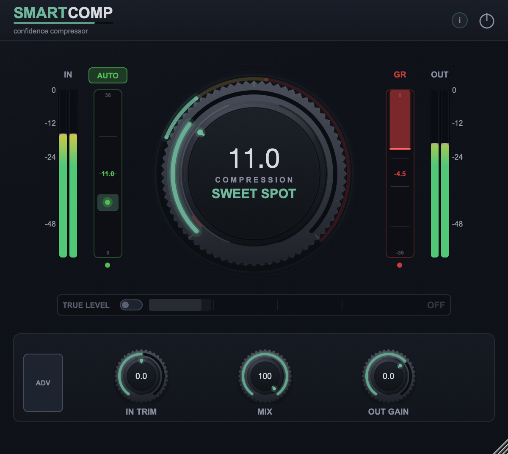

# SmartComp

Free vocal compressor for macOS (VST3/AU) that finds its own sweet spot.



## Why

Most compressors need gain staging before the knob does anything useful: set
the threshold to a fixed dBFS value, and a quiet take sits below it doing
nothing while a hot take slams. SmartComp's threshold tracks a slow average of
the incoming level instead, so a given knob position delivers roughly the same
amount of gain reduction whether the track came in at −30 dBFS or −15 dBFS.

**AUTO mode** goes a step further: it watches where the sweet spot currently
sits and drives the knob there directly, following it as the performance
changes — a quiet verse and a loud chorus each get compressed appropriately
without you touching the knob. Drag the knob away while AUTO is on and it
springs back the moment you let go, like a rubber band anchored to the sweet
spot.

The rest of the design follows the same idea: one main knob, sane defaults,
nothing to configure before it sounds right.

## Signal chain

```
In Trim → HP Filter → Compressor (auto-threshold, 2x oversampled) → Makeup
   → HONEST loudness match → Limiter → Dry/Wet Mix → Out Gain
```

Gain staging is derived, not manual: makeup gain follows the compression
actually being delivered rather than the knob position, and the limiter is a
safety net rather than the main loudness stage — across the full range of the
Compression knob it holds at 0 dB of reduction on typical vocal material.

## Parameters

| Parameter | Range | What it does |
|---|---|---|
| **Compression** | 0–36 | The main knob. Auto-tracking threshold + ratio. |
| **AUTO** | on/off | Drives the knob to the sweet spot and keeps following it. |
| **Gate** | −80 to −20 dB | Noise gate, off at minimum. |
| **HP Filter** | 0–300 Hz | High-pass on the output signal. |
| **SC HP Filter** | 0–400 Hz | High-pass on the detector only — keeps bass from pumping the gain reduction. |
| **Mix** | 0–100% | Parallel compression blend, latency-compensated. |
| **In Trim** | ±12 dB | Input gain, before the detector. |
| **Out Gain** | −24 to +12 dB | True output level (not the limiter ceiling). |
| **Bypass** | — | Latency-compensated, click-free. |

## Requirements

- macOS (Apple Silicon or Intel)
- A VST3 or Audio Unit host (Ableton Live, Logic Pro, etc.)

## Install

No signed release yet — see [INSTALL.md](INSTALL.md) for how to remove
macOS's quarantine flag from an unsigned build.

Prebuilt binaries will appear under
[Releases](https://github.com/frankknebeljanssen-create/SmartComp/releases)
once available. Until then, build from source below.

## Building from source

Requires CMake 3.15+ and Xcode command line tools.

```bash
git clone https://github.com/frankknebeljanssen-create/SmartComp.git
cd SmartComp
./build_and_install.sh
```

This clones [JUCE](https://github.com/juce-framework/JUCE) into
`~/Library/Caches/SmartComp-juce` (kept outside the repo and outside any
Dropbox-synced folder — a synced build directory causes CMake cache
conflicts), builds the plugin, and installs it to
`~/Library/Audio/Plug-Ins/VST3/`.

A small measurement harness lives in `tests/dsp_bench.cpp` — it exercises the
DSP classes directly (limiter ceiling behaviour, gain staging across the
Compression knob, transient response) rather than relying on ear judgement
alone:

```bash
cmake --build ~/Library/Caches/SmartComp-build --target dsp_bench
~/Library/Caches/SmartComp-build/dsp_bench_artefacts/Release/dsp_bench
```

`tests/auto_probe.cpp` is a behavioural regression test for AUTO mode — it
drives the real processor headlessly and checks that the Compression knob
converges on the sweet spot, springs back after being dragged away while AUTO
is on, and recovers fully after being parked in the red with AUTO off:

```bash
cmake --build ~/Library/Caches/SmartComp-build --target auto_probe
~/Library/Caches/SmartComp-build/auto_probe_artefacts/Release/auto_probe
```

The README screenshot is generated the same way rather than mocked up:
`tests/ui_shot.cpp` runs the real processor and editor through a genuine JUCE
event loop against a synthetic vocal-like signal, then saves what actually
renders.

```bash
cmake --build ~/Library/Caches/SmartComp-build --target ui_shot
open ~/Library/Caches/SmartComp-build/ui_shot_artefacts/Release/ui_shot.app --args /tmp/screenshot.png
```

## License

Not yet decided. The repository is public for now; no license has been
granted for reuse. This section will be updated before the first release.

## Companion plugin

SmartLim, a matching limiter, is planned as the second half of a set.
